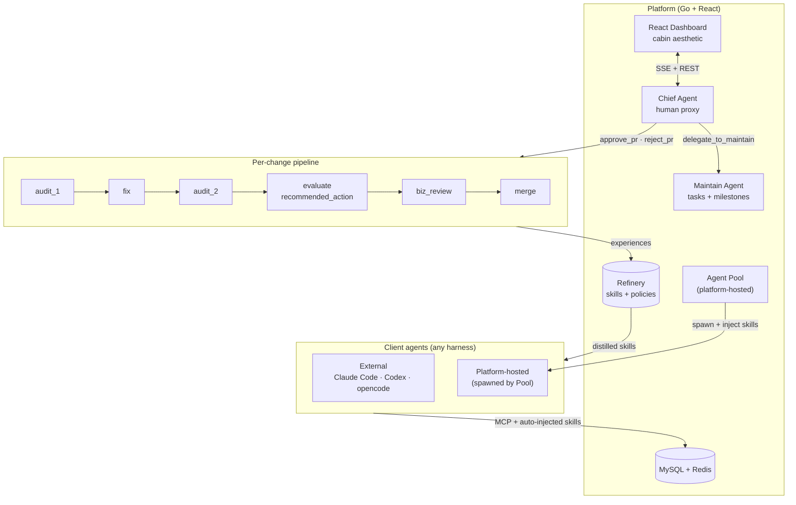

<h1 align="center">A3C</h1>
<p align="center"><em>A self-hosted multi-agent coding platform with a persistent skill library, a low-intervention human proxy, and a real self-evolution loop.</em></p>

<p align="center">
  <a href="#why-a3c"><strong>Why</strong></a> ·
  <a href="#quickstart"><strong>Quickstart</strong></a> ·
  <a href="#architecture"><strong>Architecture</strong></a> ·
  <a href="#core-ideas"><strong>Core ideas</strong></a> ·
  <a href="#comparison"><strong>Compared to…</strong></a> ·
  <a href="README.zh.md"><strong>中文</strong></a>
</p>

<p align="center">
  
  
  
  
</p>

---

## What it is

A3C is a **self-hosted platform** that runs a team of AI code-review agents on your repo. It's opinionated — not a general-purpose agent framework. It solves one problem:

> _I want a small stable of AI agents that review each others' work, merge clean PRs, escalate risky ones, and get **measurably better** every week from what they learn._

The platform runs Go + React on your machine. It talks to any OpenAI- or Anthropic-compatible LLM endpoint. Client agents can be external (Claude Code / opencode / Codex connecting over MCP) or **platform-hosted** (the platform spawns opencode subprocesses locally, auto-injects skills, and supervises them).

## Why A3C

Three things you don't get from CrewAI / AutoGen / generic agent frameworks:

### 1 · A real self-evolution loop

Every agent session produces **experiences** (`"the fix would have worked but it missed the null check"`). A background **Analyze agent** periodically distills raw experiences into **skills** (reusable patterns) and **policies** (human-risk-preference rules). Humans approve them from the dashboard. The next agent that spawns gets them injected automatically.

```
session runs → experience captured → Analyze distills → human approves skill
      ↑                                                              │
      └──────────────── skill injected into next session ────────────┘
```

No hand-rolled prompts. No static "best-practices.md". The library grows from **what actually happened on your repo**.

### 2 · A Chief agent that **can't break your platform**

Most multi-agent frameworks let the supervisor agent do anything. A3C's Chief is deliberately crippled:

| Chief can do | Chief cannot do |
|---|---|
| Approve / reject a PR (AutoMode) | Create / delete tasks directly |
| Switch milestone | Edit milestone content |
| Write a decision policy | Modify the direction |
| Delegate work to the Maintain agent | Touch anything an agent is currently working on |
| Report status to the human | Roll back a version |

This is enforced by three layers that all have to be broken to regress: role config, tool `RoleAccess`, and a test asserting the forbidden tool list. The result: in AutoMode, the human walks away knowing Chief can't accidentally delete in-flight work.

### 3 · Context management that **actually clears**

Everyone has compaction. Almost nobody has **tier-0 hard clear at semantic boundaries**:

- **Terminal-output clear** — after an agent emits its final output tool, the work unit is done; next user turn starts fresh.
- **Topic-shift clear** — new user message with <10% Jaccard overlap vs. recent turns → fresh slate.
- **Idle-gap clear** — 30 min of silence → whatever was "useful context" is now dead weight.

Clear runs **before** tier-1 microcompact and tier-2 LLM summary, so you never pay for summarising a transcript that could have been thrown away.

---

## Quickstart

### One-command (recommended)

```bash
git clone https://github.com/3gediana/teleagent-cowork.git a3c
cd a3c
docker-compose up -d            # MySQL + Redis
cp configs/config.yaml.example configs/config.yaml
# edit configs/config.yaml — point it at an LLM endpoint

# backend
cd platform/backend
go run ./cmd/server

# frontend (new terminal)
cd platform/frontend
npm install
npm run dev
```

Open <http://localhost:5173>. First login promotes you to human operator.

### Configure an LLM endpoint

A3C doesn't ship a built-in model. Register yours in **Settings → LLM Endpoints**. OpenAI-compat (including MiniMax, DeepSeek, OpenRouter) and Anthropic-compat both work. The platform auto-probes the endpoint and caches the model catalogue.

### Hook up a client agent

Two ways:

**External (your own machine runs the harness)** — copy `client/skill/using-a3c-platform/` into your Claude Code / opencode skills directory. Start the MCP bridge `node client/mcp/send-msg.mjs`. Point it at your platform. Done.

**Platform-hosted (platform spawns the agent for you)** — go to the **Agent Pool** page → Spawn Agent. The platform runs an `opencode serve` subprocess locally, writes active skills into its workdir, and registers it. It shows up in Online Agents with a `🏠 hosted` chip.

---

## Architecture



**Per-session context management** (`internal/runner/compaction.go`):

```
each turn → tier-0 clear?     → tier-1 microcompact?  → tier-2 LLM summary
            terminal-output?    strip old read/glob     structured 9-section
            topic-shift?        results (free)          summary (paid)
            idle-gap?
```

Role-gated: audit/fix/evaluate/merge skip tier-0 (single-shot). Chief/Analyze/Maintain/Consult use the full stack.

---

## Core ideas

### Refinery — experience → skill lifecycle

Every session writes `Experience` rows. A periodic **Analyze** session reviews batches of them and emits:
- **Skill candidates** — `pattern / antipattern / checklist` backed by ≥2 experience IDs
- **Policy suggestions** — `{scope, match_condition, actions, priority}` JSON
- **Tag reviews** — confirms or rejects rule-proposed tags against real execution

Humans approve candidates from the dashboard. Active skills become SKILL.md files auto-materialised into every freshly-spawned pool agent's `.claude/skills/` directory.

See `internal/service/analyze.go` + `platform/backend/internal/service/refinery/`.

### AutoMode — low-intervention operation

Flip the **AutoMode** switch (header) and the Chief starts making PR decisions based on two signals:

1. **Evaluate's `recommended_action`** (`auto_advance` / `escalate_to_human` / `request_changes`)
2. **Matching policy** from the human-defined policy library (`file_pattern`, `file_count_gt`, `merge_cost_in`, etc.)

If Evaluate says `auto_advance` and no active policy flags this PR as `require_human`, Chief auto-approves. Anything it touches is logged; humans review later.

### Platform-hosted agent pool

`internal/agentpool/` spawns `opencode serve` subprocesses on the host. Each gets:
- Isolated working dir (`data/pool/<instance_id>/`)
- Unused port from `47000–47999`
- Generated access key (via `A3C_ACCESS_KEY` env)
- **Active skills materialised as SKILL.md files** pre-boot
- Supervised: crash detected via exit-code watcher

Humans spawn / shutdown / purge from the **Agent Pool** page. Backend tests use a `FakeSpawner` + `memStore` — no subprocess or DB required.

### Two-tier + tier-0 context management

Borrowed the microcompact + summarise dance from Claude Code's source; added a tier-0 clear that catches the case where summarising is wasted effort (the prior turns are genuinely unrelated to what the user just asked). All three tiers are tested (`clear_test.go`, `compaction_test.go`) and governed by per-role policies.

---

## Project size

| Part | Lines |
|---|---:|
| Go backend (business logic) | **21,324** |
| Go entry binaries | 2,874 |
| Go tests | 6,774 (**28% test ratio**) |
| React frontend | 5,480 |
| MCP bridge | ~1,225 |
| Docs | 8,529 |
| **Total meaningful code** | **≈ 46k** |

~95% of agent logic + context management is covered by drift-guard and behavioural tests — e.g. `TestChiefRoleHasPlatformTools` enforces the "Chief cannot mutate the work queue" invariant at three layers.

---

## Comparison

| | **A3C** | CrewAI / AutoGen | ComposioHQ orchestrator | Graphite AI / CodeRabbit |
|---|---|---|---|---|
| Self-hosted | ✅ | ✅ (lib) | ✅ | ❌ (SaaS) |
| Multi-agent PR review | ✅ | ⚠ DIY | ✅ | ✅ |
| **Skills library with lifecycle** | ✅ | ❌ | ❌ | ❌ |
| **Policy-based AutoMode** | ✅ | ❌ | ⚠ manual | ✅ |
| **Platform-hosted agents** | ✅ | ❌ | ✅ | ❌ |
| **Context clear (not just compact)** | ✅ | ❌ | ❌ | ❌ |
| Scope | opinionated code-review platform | general agent framework | parallel CI fixer | hosted review bot |

A3C's wedge: the **skills library lifecycle + low-intervention Chief pattern**. If your problem is "I want a maintainable self-evolving agent team on my own hardware", nothing else in the list is designed for it.

---

## Tech stack

- **Backend** — Go 1.22 + Gin + GORM + MySQL 8 + Redis 7
- **Frontend** — React 18 + Vite + TypeScript + Tailwind + Zustand (cabin scrapbook aesthetic: parchment, Permanent Marker, wax seals)
- **LLM** — any OpenAI- or Anthropic-compatible endpoint. Registered via UI, hot-swappable per role.
- **Client** — MCP bridge (TypeScript) or platform-hosted opencode subprocess.
- **Embeddings** — bge-base-zh-v1.5 sidecar for task + artifact similarity ranking.

## Project layout

```
.
├── platform/backend/         Go backend
│   ├── cmd/server/             HTTP entry
│   └── internal/
│       ├── agent/              Role configs, prompts, tool schemas
│       ├── agentpool/          Platform-hosted subprocess pool
│       ├── runner/             Native LLM loop, tools, compaction, clear
│       ├── service/            Business logic, dispatch, refinery
│       ├── handler/            HTTP routes
│       ├── repo/               GORM queries
│       └── model/              Schema
└── docker-compose.yml        MySQL + Redis
```

## Status

Active development on `revert-v1.3`. Phase 3 native runtime is **complete** — every platform agent role (audit_1 / audit_2 / fix / evaluate / merge / maintain / chief / analyze / consult / assess) dispatches through the Go runner. The legacy `internal/opencode/` scheduler has been removed. Multi-round Chief + Maintain dashboard dialogue is stored in `model.DialogueMessage` and rehydrated as prompt prefix on each new turn, so the stateless native runner behaves like a stateful conversation to the human.

`opencode` still appears in one place on purpose: the platform-hosted **Agent Pool** spawns `opencode serve` as a subprocess for **client-side** agents (the ones that submit changes, like Claude Code or Codex would). That's an external harness, not platform runtime.

Open:
- Session lineage UI (Chief → Maintain delegation chain)
- Agent topology graph
- Proactive suggestions ported from Claude Code
- Backend-truth policy match endpoint (v1 is client-side only)
- Data-driven role→model router (see `misc/docs/dev/14_router.md` sketch)

## Contributing

PRs welcome. Read `misc/docs/dev/02_architecture.md` first. Keep the **Chief-can't-mutate-queue** invariant sacred — if you think you need to add a task-mutation tool to Chief, the answer is almost certainly `delegate_to_maintain`.

Run tests before pushing:

```bash
cd platform/backend && go test ./...
cd platform/frontend && npm run build
```

## License

MIT. See `LICENSE`.

## Credits

Two-tier compaction + read-before-edit precondition + parallel tool dispatch are adapted from reading [Claude Code](https://claude.ai/claude-code)'s source. The skills library lifecycle is original.