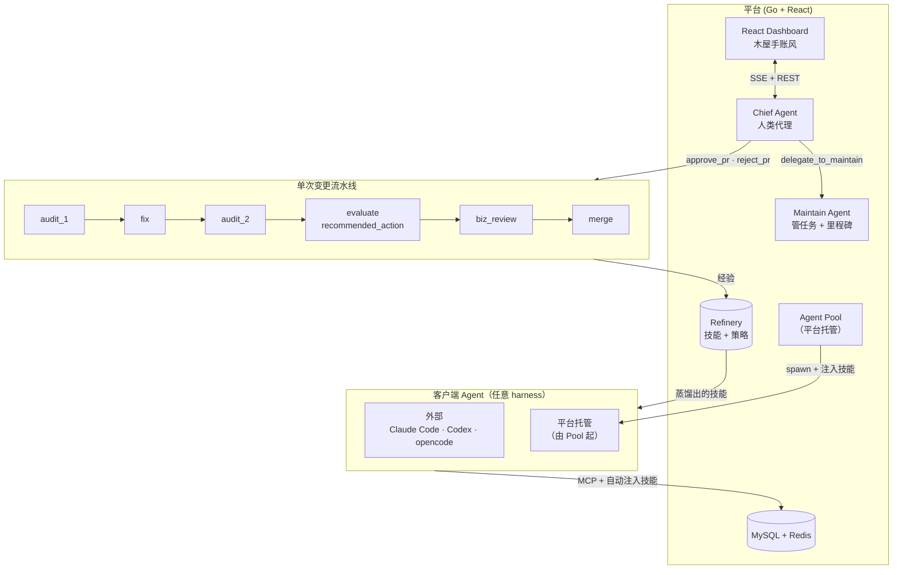

<h1 align="center">A3C</h1>
<p align="center"><em>自托管多 Agent 代码协作平台 · 持久技能库 · 低干预人类代理 · 真正闭环的自我进化</em></p>

<p align="center">
  <a href="#为什么"><strong>为什么</strong></a> ·
  <a href="#快速开始"><strong>快速开始</strong></a> ·
  <a href="#架构"><strong>架构</strong></a> ·
  <a href="#核心理念"><strong>核心理念</strong></a> ·
  <a href="#横向对比"><strong>横向对比</strong></a> ·
  <a href="README.md"><strong>English</strong></a>
</p>

---

## 这是什么

A3C 是一个**自托管平台**，在你的仓库上跑一支 AI 代码审查 Agent 小队。它是**带观点的**——不是通用 agent 框架，只专门解决一个问题：

> _我想要一支会互相审代码、合干净 PR、遇到高风险升级给人、并且每周都**肉眼可见地在进化**的 AI 小队。_

Go 后端 + React 前端跑在你自己机器上，对接任何 OpenAI / Anthropic 兼容的 LLM 端点。客户端可以是外部（Claude Code / opencode / Codex 通过 MCP 接进来），也可以是**平台托管的**（平台本地起 opencode 子进程，自动注入技能并监管）。

## 为什么

CrewAI / AutoGen 这些通用框架给不了的三件事：

### 1 · 一个**真闭环**的自我进化

每个 session 都会落下**经验**（`"这个修复本来能工作，但漏了空指针判断"`）。后台 **Analyze agent** 定期把原始经验蒸馏成**技能**（可复用模式）和**策略**（人类风险偏好规则）。你在 dashboard 上审核批准。**下一个 spawn 出来的 agent 自动带上**。

```
session 运行 → 经验捕获 → Analyze 蒸馏 → 人类批准技能
     ↑                                        │
     └────── 注入到下一个 session ────────────┘
```

没有手撸 prompt。没有静态的 best-practices.md。技能库是从**你仓库上真实发生过的事**里长出来的。

### 2 · 一个**砸不了平台**的 Chief

大多数多 agent 框架让监管 agent 想干啥干啥。A3C 的 Chief **故意被阉割**：

| Chief 可以 | Chief 不可以 |
|---|---|
| 批准 / 拒绝 PR (AutoMode) | 直接建 / 删任务 |
| 切换里程碑 | 编辑里程碑内容 |
| 写决策策略 | 修改 direction |
| 把活派给 Maintain | 碰任何 agent 正在做的工作 |
| 向人类汇报 | 回滚版本 |

三层防线（role config + tool `RoleAccess` + 测试断言禁止列表）全部破坏才会退化。结果：开了 AutoMode 你离开屏幕也知道 Chief 不会意外删掉跑到一半的活。

### 3 · Context 管理**真的会清**

压缩大家都有。**在语义边界触发 tier-0 硬清空**的几乎没有：

- **Terminal-output clear** — Agent 交付工具一调，这一轮工作就结束了；下一个用户消息从干净状态开始
- **Topic-shift clear** — 新用户消息和前面的 Jaccard 相似度 <10% → 重开一桌
- **Idle-gap clear** — 30 分钟没动静 → 刚才"有用的上下文"现在全是累赘

Clear 在 tier-1 microcompact 和 tier-2 LLM summary **之前**跑，省得花钱总结一段其实可以直接扔的 transcript。

---

## 快速开始

```bash
git clone https://github.com/3gediana/teleagent-cowork.git a3c
cd a3c
docker-compose up -d            # MySQL + Redis
cp configs/config.yaml.example configs/config.yaml
# 编辑 configs/config.yaml，填 LLM 端点

# 后端
cd platform/backend
go run ./cmd/server

# 前端（新终端）
cd platform/frontend
npm install
npm run dev
```

打开 <http://localhost:5173>。首次登录自动提升为人类操作员。

### 配置 LLM 端点

A3C **不捆绑任何内置模型**。你在 **Settings → LLM Endpoints** 里注册自己的。OpenAI 兼容（MiniMax / DeepSeek / OpenRouter 都行）和 Anthropic 兼容都支持。平台会自动探测端点并缓存可用模型列表。

### 接入客户端 Agent

两种方式：

**外部（你机器上跑 harness）**——把 `client/skill/using-a3c-platform/` 拷到你 Claude Code / opencode 的 skills 目录。启动 MCP bridge `node client/mcp/send-msg.mjs`，指向你的平台。完事。

**平台托管（平台替你起 agent）**——去 **Agent Pool** 页点 Spawn Agent。平台本地起一个 `opencode serve` 子进程，把当前激活的技能全部写到它工作目录里，然后注册。它会出现在 Online Agents 列表里带一个 `🏠 hosted` 徽章。

---

## 架构



**单 session 上下文管理**（`internal/runner/compaction.go`）：

```
每一轮 → tier-0 清空？        → tier-1 microcompact？ → tier-2 LLM summary
         terminal-output？      清掉陈旧 read/glob     9 段结构化
         topic-shift？          结果（免费）            摘要（付费）
         idle-gap？
```

按角色分配：audit/fix/evaluate/merge 跳过 tier-0（一次性角色）。Chief / Analyze / Maintain / Consult 用完整三层。

---

## 核心理念

### Refinery — 经验到技能的生命周期

每个 session 写入 `Experience` 行。定期跑的 **Analyze** session 批量审查这些经验，产出：
- **技能候选** — `pattern / antipattern / checklist` 必须有 ≥2 个经验 ID 背书
- **策略建议** — `{scope, match_condition, actions, priority}` JSON
- **标签复核** — 用真实执行数据验证或否定规则提出的标签

人类在 dashboard 批准候选。批准后的技能会被自动写成 SKILL.md，材料化到每个新 spawn 出的 pool agent 的 `.claude/skills/` 目录。

见 `internal/service/analyze.go` + `platform/backend/internal/service/refinery/`。

### AutoMode — 低干预运行

打开 header 上的 **AutoMode** 开关，Chief 就会基于两个信号自动做 PR 决策：

1. **Evaluate 的 `recommended_action`**（`auto_advance` / `escalate_to_human` / `request_changes`）
2. 从人类定义的策略库里**匹配到的 policy**（`file_pattern`、`file_count_gt`、`merge_cost_in` 等）

如果 Evaluate 说 `auto_advance` 并且没有 active policy 把这个 PR 标记为 `require_human`，Chief 自动批准。所有操作都有日志，人类事后回看。

### 平台托管 Agent 池

`internal/agentpool/` 在本机起 `opencode serve` 子进程。每个 instance 会得到：
- 独立工作目录（`data/pool/<instance_id>/`）
- 从 `47000–47999` 选一个空闲端口
- 生成的 access key（通过 `A3C_ACCESS_KEY` 环境变量注入）
- **启动前预写好当前所有激活技能的 SKILL.md**
- 监管：退出码监听检测崩溃

人类从 **Agent Pool** 页面 spawn / shutdown / purge。后端测试用 `FakeSpawner` + `memStore`——不用真起子进程、不用真起数据库。

### 两级 + 零级上下文管理

microcompact 和 summarise 这对组合是从 Claude Code 源码学过来的；在此之上加了 tier-0 clear，专门抓那些"总结纯属浪费钱"的场景（前面的轮次和用户刚问的问题压根无关）。三层都有测试（`clear_test.go`, `compaction_test.go`），按角色策略治理。

---

## 代码规模

| 部分 | 行数 |
|---|---:|
| Go 后端业务 | **21,324** |
| Go 入口二进制 | 2,874 |
| Go 测试 | 6,774（**28% 测试率**） |
| React 前端 | 5,480 |
| MCP 桥 | ~1,225 |
| 文档 | 8,529 |
| **核心代码合计** | **≈ 46k** |

Agent 逻辑和上下文管理约 95% 被 drift-guard 和行为测试覆盖——例如 `TestChiefRoleHasPlatformTools` 在三层同时强制"Chief 不能动工作队列"这一不变量。

---

## 横向对比

| | **A3C** | CrewAI / AutoGen | ComposioHQ orchestrator | Graphite AI / CodeRabbit |
|---|---|---|---|---|
| 自托管 | ✅ | ✅（库） | ✅ | ❌（SaaS） |
| 多 agent 审 PR | ✅ | ⚠ 自己搭 | ✅ | ✅ |
| **技能库生命周期** | ✅ | ❌ | ❌ | ❌ |
| **Policy-based AutoMode** | ✅ | ❌ | ⚠ 人肉 | ✅ |
| **平台托管 agent** | ✅ | ❌ | ✅ | ❌ |
| **Context clear（不只压缩）** | ✅ | ❌ | ❌ | ❌ |
| 范围 | 带观点的代码审查平台 | 通用 agent 框架 | 并行 CI 修复器 | 托管审查机器人 |

A3C 的楔子：**技能库生命周期 + 低干预 Chief 模式**。如果你的问题是"我想在自己机器上跑一支能维护、会自我进化的 agent 小队"，上面清单里没有一个是为这个问题设计的。

---

## 技术栈

- **后端** — Go 1.22 + Gin + GORM + MySQL 8 + Redis 7
- **前端** — React 18 + Vite + TypeScript + Tailwind + Zustand（木屋剪贴簿风格：羊皮纸、Permanent Marker 字体、蜡封徽章）
- **LLM** — 任何 OpenAI / Anthropic 兼容端点。UI 注册，按角色热切换。
- **客户端** — MCP 桥（TypeScript）或平台托管的 opencode 子进程。
- **Embedding** — bge-base-zh-v1.5 sidecar，用于任务 + 产物相似度排名。

## 项目结构

```
.
├── platform/backend/         Go 后端
│   ├── cmd/server/             HTTP 入口
│   └── internal/
│       ├── agent/              角色配置、prompt、工具 schema
│       ├── agentpool/          平台托管子进程池
│       ├── runner/             原生 LLM 循环、工具、compaction、clear
│       ├── service/            业务逻辑、调度、refinery
│       ├── handler/            HTTP 路由
│       ├── repo/               GORM 查询
│       └── model/              schema
├── platform/frontend/        React 看板
│   └── src/{api,components,pages,hooks,stores}
├── client/
│   ├── skill/                  可自动加载的技能（会被拷到 pool agent）
│   └── mcp/                    外部客户端用的 TypeScript MCP 桥
├── configs/                  config.yaml.example（路径硬编码在后端）
├── misc/                     非核心收纳
│   ├── bench/                  tasq-experiment 实验台
│   ├── docs/                   架构、阶段规划、设计规范
│   └── scripts/                一次性启动脚本（含 launch-attach.ps1）
└── docker-compose.yml        MySQL + Redis
```

## 当前状态

在 `revert-v1.3` 上活跃开发。Phase 3 原生运行时**已完成**——每一个平台角色（audit_1 / audit_2 / fix / evaluate / merge / maintain / chief / analyze / consult / assess）都走 Go runner 派发。遗留的 `internal/opencode/` 调度器已经被删除。多轮 Chief + Maintain 对话历史存在 `model.DialogueMessage`，每轮以 prompt 前缀回灌，让无状态的 native runner 对人类表现得像有状态对话。

`opencode` 在一个地方仍然保留：平台托管的 **Agent Pool** 把 `opencode serve` 作为子进程起来当**客户端** agent 使用（就像 Claude Code / Codex 那种，负责提交改动）。那是外部 harness，不是平台运行时。

待办：
- Session 血缘 UI（Chief → Maintain 派遣链）
- Agent 拓扑图
- 从 Claude Code 移植 Proactive suggestions
- 后端真相的策略匹配端点（目前 v1 纯前端）
- 数据驱动的角色→模型路由（见 `misc/docs/dev/14_router.md` 草图）

## 贡献

欢迎 PR。先读 `misc/docs/dev/02_architecture.md`。**Chief 不能动工作队列**这个不变量神圣不可侵犯——如果你觉得 Chief 需要一个新的"改任务"工具，99% 概率答案是 `delegate_to_maintain`。

提交前跑测试：

```bash
cd platform/backend && go test ./...
cd platform/frontend && npm run build
```

## License

MIT，见 `LICENSE`。

## 致谢

两级 compaction + read-before-edit 前置 + 并行工具调度是读 [Claude Code](https://claude.ai/claude-code) 源码改过来的。技能库生命周期是原创的。
